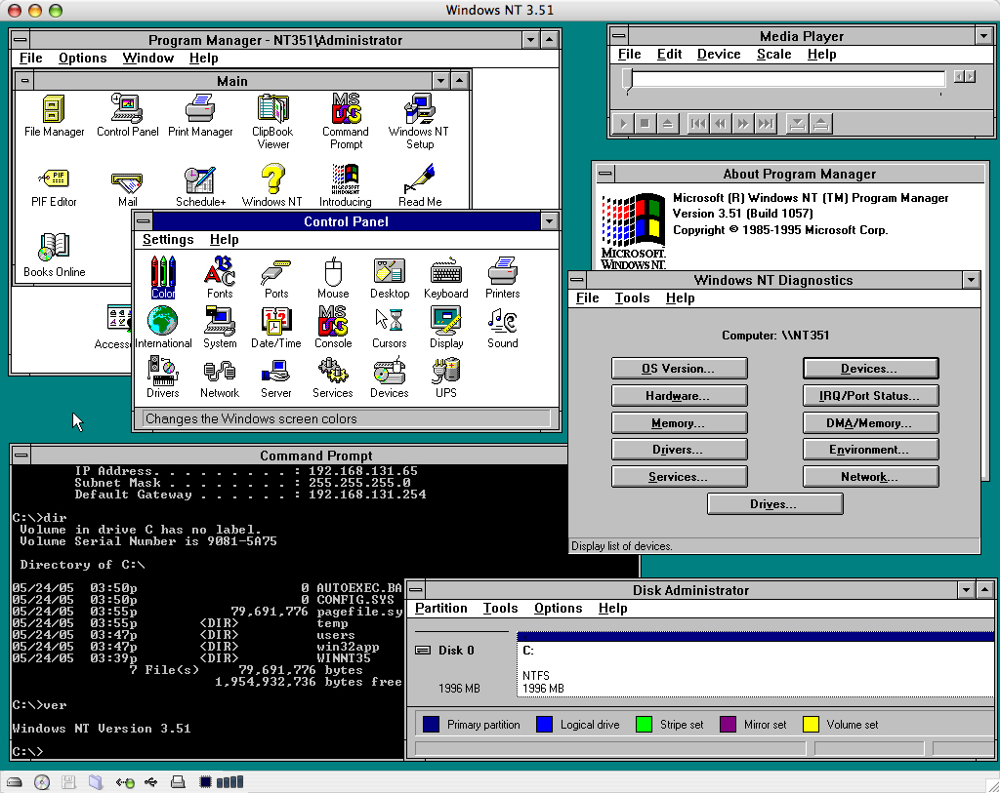
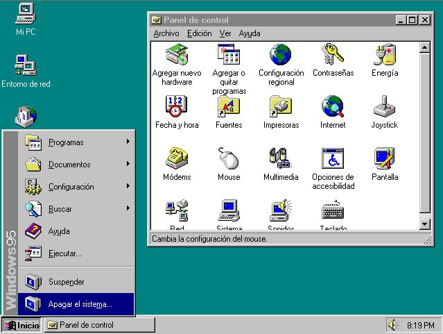
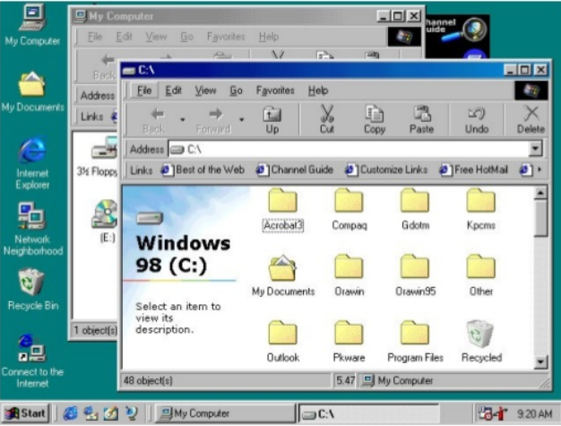
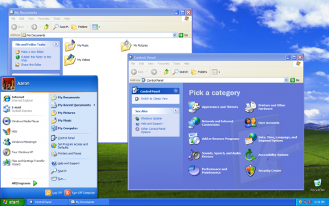
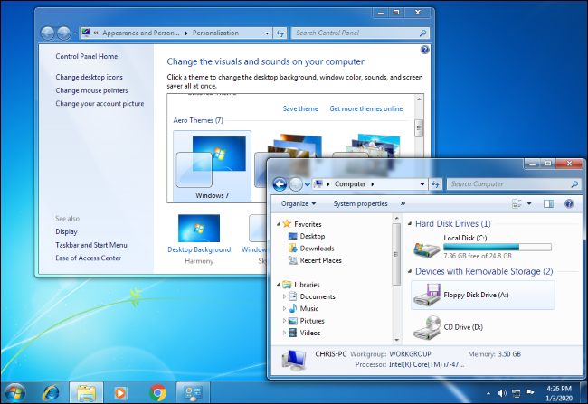
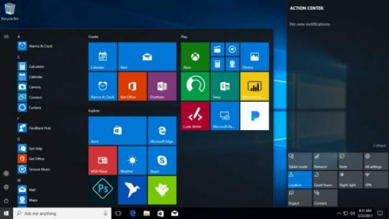
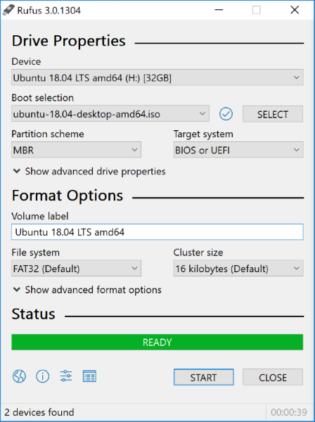

# Sistemas Operativos
<small>
Created by <i class="fab fa-telegram"></i>
[edme88]("https://t.me/edme88") & 
<i class="fab fa-telegram"></i>
[rmarku]("https://t.me/rmarku")
</small>

---
<!-- .slide: style="font-size: 0.60em" -->
## Sistema Operativo
* Definicion
* Tareas
* Ejemplos de SO
* Criterios de Clasificación
* Recursos de Hardware

## Máquinas Virtuales
* Definición 
* Características
* Ventajas
* Aplicaciones

## BIOS y UEFI
* Definición
* Función
* Forma de funcionamiento

---
## Sistema Operativo
    
Es un programa que administra el Hardware de una computadora. 
Proporciona las bases para los programas de aplicación y actúa como un intermediario entre el usuario y el hardware.

---
## Sistema Operativo

---
## SO: Tareas
<!-- .slide: style="font-size: 0.90em" -->
Las tareas que hace un SO son:
* Realizar el interfaz Sistema-Usuario
* Compartir los recursos de Hardware entre los usuarios
* Permitir a los usuarios comaprtir sus datos entre ellos
* Prevenir que las actividades de un usuario no interfieran en las de los demás usuarios
* Calendarizar los recursos de los usuarios
* Facilitar el acceso a los dispositivos de E/S
* Recuperarse de fallas o errores
* Llevar el control sobre el uso de los recursos

---
##  [Ejemplos de Sistema Operativo](http://gs.statcounter.com/os-market-share)
<!-- .slide: data-background="images/configSO/OtrosOS.png" data-background-size="50%" style="font-size: 0.80em" -->
Para PC:
* Solaris
* Linux
* Windows 7
* Mac OS X
* FreeBSD

Para dispositivos móviles:
* Android
* Windows phone
* iOS
* Blackberry

---
## Criterios para Definir SO
* Tipo de Interfaz
  * Gráfica (GUI)
  * Línea de comandos
* Cantidad de tareas
  * Multitarea
  * Monotarea
* Cliente o Servidor
* Tipo de Licencia
  * Propietario
  * Libre

---
## Ejercicio: Criterios de SO
En base a tus conocimientos previos, completa la siguiente tabla:
<table>
<tr>
    <td>SO</td>
    <td>Año</td>
    <td colspan="2">Tipo de Interfaz</td>
    <td colspan="2">Tareas</td>
    <td colspan="2">Arquitectura</td>
    <td colspan="2">Licencia</td>
</tr>
<tr>
    <td></td>
    <td></td>
    <td>GUI</td>
    <td>CLI</td>
    <td>Mono</td>
    <td>Multi</td>
    <td>Cliente</td>
    <td>Servidor</td>
    <td>Libre</td>
    <td>Propietario</td>
</tr>
<tr>
    <td>Windows 3.11</td>
    <td></td>
    <td></td>
    <td></td>
    <td></td>
    <td></td>
    <td></td>
    <td></td>
    <td></td>
    <td></td>
</tr>
<tr>
    <td>Windows NT</td>
    <td></td>
    <td></td>
    <td></td>
    <td></td>
    <td></td>
    <td></td>
    <td></td>
    <td></td>
    <td></td>
</tr>
<tr>
    <td>Windows 95</td>
    <td></td>
    <td></td>
    <td></td>
    <td></td>
    <td></td>
    <td></td>
    <td></td>
    <td></td>
    <td></td>
</tr>
<tr>
    <td>Windows 10</td>
    <td></td>
    <td></td>
    <td></td>
    <td></td>
    <td></td>
    <td></td>
    <td></td>
    <td></td>
    <td></td>
</tr>
<tr>
    <td>Ubuntu 20</td>
    <td></td>
    <td></td>
    <td></td>
    <td></td>
    <td></td>
    <td></td>
    <td></td>
    <td></td>
    <td></td>
</tr>
<tr>
    <td>Ubuntu Server</td>
    <td></td>
    <td></td>
    <td></td>
    <td></td>
    <td></td>
    <td></td>
    <td></td>
    <td></td>
    <td></td>
</tr>
<tr>
    <td>Red Hat</td>
    <td></td>
    <td></td>
    <td></td>
    <td></td>
    <td></td>
    <td></td>
    <td></td>
    <td></td>
    <td></td>
</tr>
<tr>
    <td>Mac OS X</td>
    <td></td>
    <td></td>
    <td></td>
    <td></td>
    <td></td>
    <td></td>
    <td></td>
    <td></td>
    <td></td>
</tr>
</table>
Objetivo: Ver como el software va evolucionando en conjunto con el hardware.

---
## Recursos de Hardware
<!-- .slide: style="font-size: 0.80em" -->
Los SO requieren ciertos recursos de Hardware para funcionar:
1. Memoria RAM
2. Espacio disponible en Disco Duro
3. Tipo y velocidad del procesador
4. Resolución de video

---
## Hardware: Mínimo y Recomendado
Con la configuración del hardware **mínima** el rendimiento del sistema suele ser pobre, ya que el SO sólo podrá ejecutar funciones básicas.

Con la configuración de hardware **recomendada** el SO funciona a una velocidad adecuada.

---
## Ejercicio: Comparar SO
En base a las siguientes diapositivas, completa la tabla:
<table>
<tr>
    <td>Requisitos</td>
    <td>3.11</td>
    <td>NT</td>
    <td>95</td>
    <td>98</td>
    <td>XP</td>
    <td>7</td>
    <td>10</td>
</tr>
<tr>
    <td>Año</td>
    <td></td>
    <td></td>
    <td></td>
    <td></td>
    <td></td>
    <td></td>
    <td></td>
</tr>
<tr>
    <td>Procesador</td>
    <td></td>
    <td></td>
    <td></td>
    <td></td>
    <td></td>
    <td></td>
    <td></td>
</tr>
<tr>
    <td>Memoria Ram</td>
    <td></td>
    <td></td>
    <td></td>
    <td></td>
    <td></td>
    <td></td>
    <td></td>
</tr>
<tr>
    <td>Disco Duro</td>
    <td></td>
    <td></td>
    <td></td>
    <td></td>
    <td></td>
    <td></td>
    <td></td>
</tr>
<tr>
    <td>Tarjeta Gráfica</td>
    <td></td>
    <td></td>
    <td></td>
    <td></td>
    <td></td>
    <td></td>
    <td></td>
</tr>

</table>
Objetivo: Ver como el software va evolucionando en conjunto con el hardware.

---
#### Advertencia: Algunas de las siguientes imágenes nos harán viajar en el tiempo... 
<!--Descargar audio https://www.youtube.com/watch?v=tHr46P2r514-->

---
## Requisitos mínimos de 
## Windows 3.11
* Año: 1990
* Procesador 80386sx o superior (25 MHz)
* 3 MB de ram (se recomienda 4 MB)
* Al menos 6.2 MB de espacio disponible en disco duro (se recomienda 14.5 MB)
* Monotarea

---
## Windows 3.11

---
## Requisitos mínimos de
## Windows NT Server
* Año: 1993
* Procesador de 32 bits basado en intel x86: 80486 a 33 Mhz o superior
* 16 MB de memoria ram
* Al menos 125 MB de espacio disponible en disco duro
* adaptador de pantalla de video con resolución VGA o superior
* Multitarea
   
---
## Windows NT

   
---
## Requisitos mínimos de
## Windows 95
* Año: 1995
* Procesador 386DX 33 MHz o superior
* Mínimo 4 MB de RAM (de preferencia 8 MB)
* Mínimo 55 Mb de espacio disponible en disco duro
* 1 unidad de disco de alta densidad de 3,5 pulgadas
* Resolución VGA o superior (se recomienda SVGA de 256 colores)
* Multitarea

---
## Windows 95

---
## Requisitos mínimos de
## Windows 98
* Año: 1998
* Procesador 486DX de 66 MHz o superior
* Mínimo 16 MB de RAM (de preferencia 24 MB)
* 120 a 295 MB de espacio disponible en disco duro
* 1 unidad de disco de alta densidad de 3,5 pulgadas
* Resolución VGA o superior (se recomienda SVGA de 256 colores)
* Internet (MSN, Mensajeria): Modem 14,4 bits por segundo (bps),recomendado 28,8 bits o más rapido

---
## Windows 98

---
## Requisitos mínimos de
## Windows XP
* Año: 2001
* Procesador Pentium 233 MHz o superior (de preferencia de 300 HMz)
* Mínimo 64 MB de RAM (de preferencia 128 MB)
* Mínimo 1,5 GB de espacio disponible en disco duro
* Tarjeta gráfica y monitor de resolución Súper VGA (800x600) o superior

---
## Windows XP

---
## Requisitos mínimos de
## Windows 7
* Año: 2007
* Procesador de 32bit o 64bits a 1GHz o más
* 1GB de RAM para 32bits, o 2GB de RAM para 64bits
* 16GB de espacio disponible en disco duro para 32bits, o 20GB para 64bits
* Dispositivo gráfico DirectX9.

---
## Windows 7

---
## Requisitos mínimos de
## Windows 10
* Año: 2015
* Procesador de 32bit o 64bits a 1GHz o más
* 1GB de RAM para 32bits, o 2GB de RAM para 64bits
* 16GB de espacio disponible en disco duro para 32bits, o 20GB para 64bits
* Dispositivo gráfico DirectX9.

<!---https://www.xataka.com/especiales/maquinas-virtuales-que-son-como-funcionan-y-como-utilizarlas-->

---
## Windows 10

---
## Requisitos mínimos de
## Ubuntu 11.10
* Año: 2011
* Procesador de 32bit (x86) a 1GHz
* 1GB de RAM
* 15 GB de espacio disponible en disco duro
* Tarjeta gráfica que soporte resolución 800x600

---
## Requisitos mínimos de
## Mac OS X Lion
* Año: 2011
* Procesador Itel de 64 Bits (itel Core 2 Duo, i3, i5, i7 o Xeon)
* 2 GB de RAM
* 7 GB de espacio disponible en disco duro
* Tarjeta gráfica que soporte resolución 800x600

---
## Máquina Virtual
Es un software que simula a un computadora y puede ejecutar programas.
Se puede configurar para que los procesos que ejecutan están limitados por los recursos proporcionados.
Habitualmente se usa para ejecutar sistemas operativos y "probarlos".

---
## Máquina Virtual

---

---
## Máquina Virtual: Características
* La MV no puede acceder al resto de datos de la máquina anfitrion.
* Para funcionar, una MV mapea los dispositivos virtuales que ofrece a su invitado con los dispositivos reales presentes en la máquina física.
* Copias de Seguridad y Clonación
* Crear entornos de prueba

---
## Máquina Virtual: Ventajas
* Probar sistemas operativos
* Ejecutar programas antiguos
* Usar software que no esta disponible en nuestro SO
* Probar una aplicación en distintos sistemas
* Copias de Seguridad y Clonación
* Crear entornos de prueba

---
## Máquinas Virtuales: Aplicaciones
* VMWare
* Virtual Box
* Qemu
* Parallels

---
## Ejercicio: Windows-Máquina Virtual
**Instale Windows** en una computadora o máquina virtual (recuerde sacar screenshots del proceso).

Descarga SO:
[Windows 10](https://www.microsoft.com/es-es/software-download/windows10)

Descarga Máquina Virtual: 
[VirtualBox](https://www.virtualbox.org/)

---
## Basic Input/Output System
La BIOS es el software que localiza y reconoce los dispositivos necesarios para cargar el Sistema Operativo en la memoria RAM.

---
## Basic Input/Output System
Es el encargado de gestionar el hardware y permite gestionar el arranque, es decir, seleccionar desde qué dispositivo debería leer el SO.

También Puede controlar la frecuencia de la RAM, de la tarjeta gráfica, las revoluciones de los ventiladores, periféricos, etc.

---
## Basic Input/Output System
Está integrado en un chip en la placa madre, y el firmware puede ser actualizado y grabado en la memoria flash que posee integrada.

Sólo puede ser modificado por una actualización del fabricante,. Su memoria es de solo lectura.

---
## Basic Input/Output System
Una vez que el BIOS comprueba que los componentes de la computadora funcionan correctamente, le pasa el control del hardware al sistema operativo.

---
## Basic Input/Output System

---
## Basic Input/Output System

---
## Basic Input/Output System

---
## Unified Extensible Firmware Interface
Es una interfaz entre el sistema operativo y el firmware que reemplaza la antigua interfaz del BIOS.

---
## Unified Extensible Firmware Interface

---
## UEFI: Mejoras
* La interfaz permite usar el mouse, e incluye sonidos y animaciones.
* El SO carga más rápido, a la velocidad del SSD (Disco Estado Sólido)
* Compatible con sistemas de archivos GTP (Guid Partition Table). Discos de 9.4 Zetabytes. 128 particiones.
* Compatibilidad nativa con 64bits
* Mayor seguridad durante el inicio (evita bootkits, virus que se ejecutan antes de que Windows inicie)

---

---
## Ejercicio: BIOS o UEFI
Entre a la sección del “BOOT Loader” dentro de la BIOS y ordene adecuadamente los dispositivos de arranque del sistema. (F1, F2, Del)

---
## Formateado de Discos
**Formatear** un disco duro consiste en restablecer a este a su estado original para ser reutilizado o reescrito con una nueva información.
        
Al realizar esta operación se elimina toda la información contenida en el.

---
## Formateado de Discos (lógico)
* **Windows:** ExFAT, FAT, FAT16, FAT32, NTFS, EFS.
* **Linux:** ext2, ext3, ext4, JFS, ReiserFS, Reiser4, XFS.
* **Solaris:** UFS, ZFS.
* **Mac OS:** HFS, HFS+.
* **IBM:** JFS, GPFS. 
* **Discos Ópticos:** UDF.

---
## IMPORTANTE!!!
<!-- .slide: data-background="images/herramientas/Busydesk-desarrollo.png" -->
Recuerda **ANTES** de formatear hacer backup de tus datos, así evitas perder información.

---
## [Qué es Rufus?](https://rufus.ie/)
<!-- .slide: style="font-size: 0.80em" -->
Rufus es una utilidad que le ayuda a formatear y crear soportes USB de arranque, como pendrives, tarjetas de memoria, etc.

Es especialmente útil en casos donde:
* necesite crear medios de instalación USB a partir de ISOs arrancables (Windows, Linux, UEFI, etc.)
* necesite trabajar en un equipo que no tenga un sistema operativo instalado
* necesite actualizar el firmware o BIOS de un ordenador desde DOS
* quiera ejecutar una utilidad de bajo nivel

---
## [Qué es Rufus?](https://rufus.ie/)

---
## MBR vs GPT
#### Master Boot Table vs GUI Partition Table
Formatos de la tabla de particiones.
* GPT: Para sistemas de 64 bits (Windows Vista, 7, 8, 10) y UEFI
* GPT: Para sistemas de 32 bots (Windows 8, 10) y UEFI
* MBR: Para sistemas de 32 bits (Vista, 7)
Equipo > Administrar > Administración de Discos

---
## Ejercicio: Rufus
Crear un pen drive autobooteable de Windows 10 empleado Rufus.

---
## Particionado de Discos
Una **partición** es la división de espacio que se le asigna a un disco duro.

Un disco duro puede tener varias particiones, que son de cierto modo independientes entre si, dado que cada una de ellas tiene su propio sistema de archivos o formato, y el SO lo reconoce como un disco independiente (aunque físicamente sea uno).

Se puede formatear una partición sin necesidad de formatear todo el disco.

---
## Tipos de Particiones
<!-- .slide: style="font-size: 0.80em" -->
**Partición Primaria:** Se encarga de iniciar la carga del SO

**Partición Extendida o Secundaria:** Almacenan información

---
## Pasos de Instalación de un SO
1. Cofiguración de dispositivo de arranque en la BIOS
2. Formateo de Discos
3. Particionado de discos
4. Creació de sistema de ficheros
5. Configuración de la red, dispositivos, pantalla, idioma, usuarios, etc.

---
## ¿Dudas, Preguntas, Comentarios?

