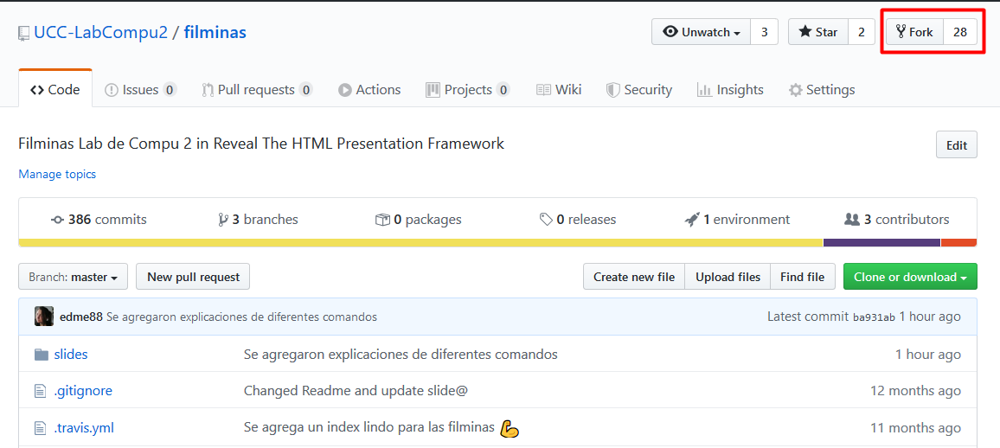

# Git II: Más Git que Nunca!
<small>
Created by <i class="fab fa-telegram"></i>
[edme88]("https://t.me/edme88") & 
<i class="fab fa-telegram"></i>
[rmarku]("https://t.me/rmarku")
</small>

---
## Git Brach
Branch significa **rama**. 
Las ramas son caminos que puede tomar el desarrollo de un software, algo que ocurre generalmente para resolver problemas o crear nuevas funcionalidades. 

Las **branch** permiten que nuestro proyecto pueda tener diversos estados y que los desarrolladores sean capaces de pasar de uno a otro de una manera ágil.

El **branching** permite el desarrollo en paralelo sin interferencia entre las diferentes ramas. 

---
## Git Brach
Cuando se crea un repositorio, por defecto se emplea la rama principal **master**. 

Podemos verificar esto entrando a nuestro repositorio (ejercicio1), y escribiendo:
```
git branch
```

---


---
## Branching
* Master: Contiene una versión estable y funcional del código.
* Se pueden crear ramas para desarollar nuevas funcionalidades **feature**
* En equipos de trabajo, Se puede crear una rama para cada desarrollar o **developer**
* Se pueden crear ramas para trabajar en soluciones a los defectos o errores encontrados, **hotfix**

---
## Comandos de Branch
* branch
* checkout
* merge
* push

---
## git branch
Permite visualizar en que rama se está trabajando
````
git branch
````
ó, Permite crear una rama nueva
````
git branch nombre_rama
````

---
## git checkout
Permite movernos de una rama a otra
````
git checkout nueva_rama
````

---
## git merge
A medida que crees ramas y cambies el estado del las carpetas o archivos tu proyecto empezará a divergir de una rama a otra. 
Llegará el momento en el que te interese fusionar ramas para poder incorporar el trabajo realizado a la rama master. 

Parados en la rama **master**:
````
git merge nueva_rama
````

---
## Ejercicio: Github Branchs
Empleando el repositorio ejercicio1 [PDF paso a paso](https://drive.google.com/open?id=1FZ54y3soPcTVKzbj4rWlSJjb_HYk121x):
* Visualizar en que rama estamos trabajando
* Cree una nueva rama (develop)
* Vea el listado de todas las branchs
* Cambie de rama
* Realice algún cambio en el código y commit al repositorio local
* Visualice en Github los commits de las branchs
* Merge de la nueva rama con Master
* Borrar una branch
---
## Reppaso de Terminología
* **Branch (rama):** Linea de desarrollo del proyecto
* **Merge:** Mezcla codigo de 2 ramas

---
## Fork
Alguna vez te pasó que en **GitHub** encontraste un código que te era de utilidad? 

Quizás encontraste un código de un juego y te dijiste: "Quiero hacer mi propia versión"?

O un proyecto que era interesante y querias hacer tus propias pruebas? 

Esto se soluciona con un **fork**!!!

---
## Fork
Hacerle **fork** a un repositorio significa copiarlo. Así podemos modificar el código sin afectar al proyecto original.

Se utiliza para proponer cambios en el proyecto de otra persona u organización ó para utilizar el proyecto de otra 
persona como punto de partida para nuevas ideas.

---
## Fork: Ejemplo
Si quisieras investigar como hacer filminas con tecnologia markdown, podrias emplear este [repositorio](https://github.com/UCC-LabCompu2/filminas)


---
#### Hice un cambio muy bueno en el repositorio, y quisiera que el autor original del código incorpore ese cambio?!?
Esto se soluciona con un **pull request**

---
## Pull Request
Un pull request es una petición que el propietario de un fork de un repositorio hace al propietario del repositorio 
original para que este último incorpore los commits que están en el fork.

También se denomina pull request a una solicitud que se realiza de una branch a otra para mergearse (generalmente 
después de un code review y si no se tienen permisos de merge a master).

<!--http://aprendegit.com/que-es-un-pull-request/-->

---
#### Sigo sin enter como funcionan las ramas con los comandos...
* push
* pull
* merge

No te preocupes, te lo explicamos con gatitos (si, nada que tenga gatitos puede fallar!)


---   


---


---


---
## .gitignore
El archivo "gitignore" sirve para decirle a Git qué archivos o directorios completos debe ignorar y no subir al repositorio de código. 

Puede que no sea necesario versionar esos archivos porque: son privados y no se desea compartir, son archivos binarios 
con datos que no se desa versionar (instaladores, diagramas, etc).
 
---
## +
Existen muchos comandos de git, y parámetros que se pueden agregar a comandos ya existentes, pero has aprendido lo básico 
(e inclusive un poquito más) para que puedas trabajar versionando tus proyectos de software.
 
---
## ¿Dudas, Preguntas, Comentarios?

