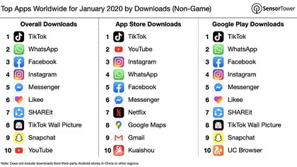
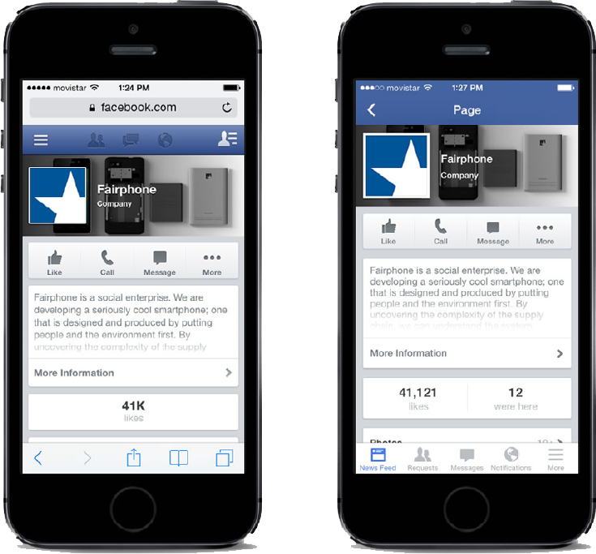
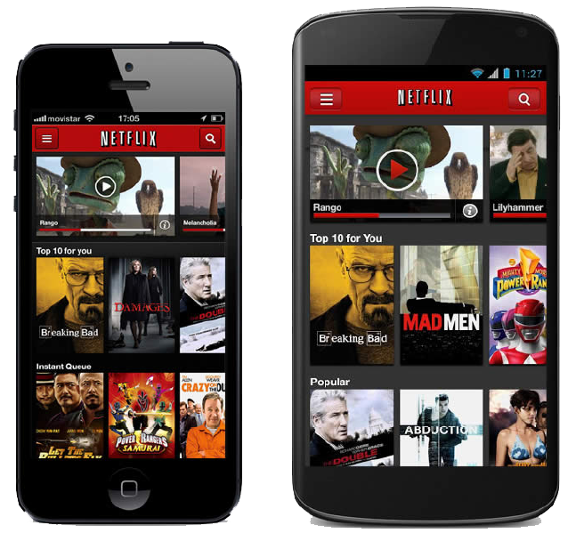
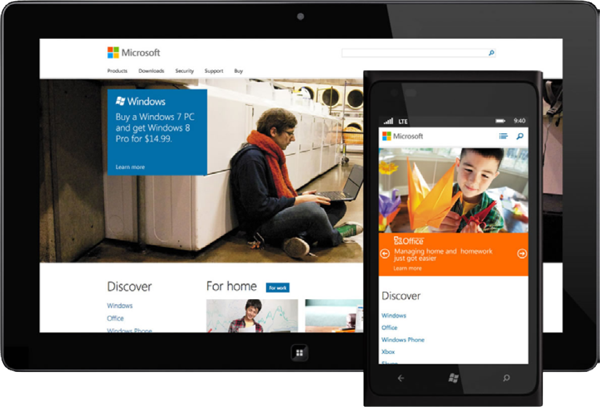
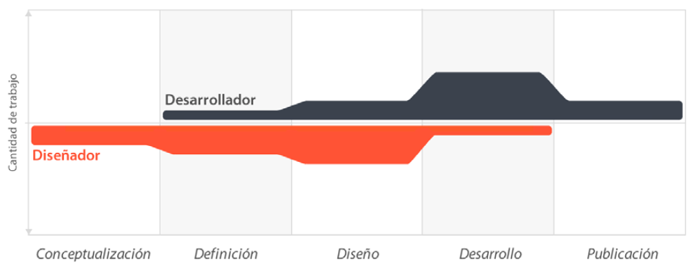

# Unidad 6: Aplicaciones Móviles
<small>
Created by <i class="fab fa-telegram"></i>
[edme88]("https://t.me/edme88") & 
<i class="fab fa-telegram"></i>
[rmarku]("https://t.me/rmarku")
</small>

---
## Libros:

[“Diseñando APPS para móviles” Javier Cuello y José Vittone](http://appdesignbook.com/es/contenidos/tipos-de-apps/)

---
## Aplicaciones Moviles o APP
Son aplicaciones diseñada para ser ejecutadas en teléfonos inteligentes, tablets y otros dispositivos móviles y que 
permite al usuario efectuar una tarea, facilitando la gestión o actividad a desarrollar.


---
## Aplicaciones Moviles o APP
Inicialmente estaban enfocadas en **mejorar la productividad personal**:
* Alarmas
* Calendarios
* Calculadoras
* Clientes de Correo

---
## Diferencia entre APP y Web Móvil
Las APP deben ser descargadas e instaladas antes de usarse.

Las Webs se acceden empleando internet y un navegador.

Las APPs pueden verse sin internet y tienen acceso a ciertas características del hardware del teléfono.

---
## [Ejemplos de Aplicaciones Móviles](https://www.infobae.com/america/tecno/2020/03/03/cuales-son-las-10-aplicaciones-mas-descargadas-del-mundo/)
<!-- .slide: style="font-size: 0.80em" -->
* Whatsap
* Telegram
* Instagram
* Opera Mini
* Clash of Clans



---
## Categorías de Aplicaciones
### Según el contenido:</h3>
* Entretenimiento
* Sociales
* Utilitarias y Productividad
* Educativas e Informativas
* Creación 

---
## Categorías de Aplicaciones
### Según el costo:</h3>
* Apps Gratuitas 
<p class="fragment"> <small>(mayor llegada a los usuarios, disminuye expectativa del producto, suele incluir publicidad) </small></p>

* Apps de Pago 
<p class="fragment"> <small>(altas expectativas, será exitosa si no tiene rivales gratuitos)</small> </p>

* Fremium 
<p class="fragment"><small>(uso básico, que se amplia al pagar)</small> </p>


---
## Tipos de Aplicaciones
* Aplicaciones Nativas
* Aplicaciones Web
* Aplicaciones Hibridas

---
## Características de App
* Capacidad de comunicarse desde cualquier lugar
* Interfaz de usuario para pantalla y teclado pequeno
* Movilidad del dispositivo
* Disponibilidad de muchos sensores

---
## [Sistemas Operativos para Dispositivos móviles](https://gs.statcounter.com/os-market-share/mobile/worldwide)
* Android
* iOS
* kaios
* ~~Windows Phone~~
* ~~Blackberry~~
* ~~Ubuntu Phone~~
* ~~Firefox OS~~
* ~~Tizen~~
* Fucshia <small>(comming soon...)</small></br>

---
## Apps Android
* **Lenguaje:** Java o Kotlin + Librerias Android
* **IDE:** [Android Studio](https://developer.android.com/studio)
* **SO:** Windows, Linux o Mac
* Emuladores de Dispositivos
    
---
## Apps iOS
* **Lenguaje:** ObjetiveC - Swift
* **IDE:** [XCode](https://developer.apple.com/xcode/)
* **SO:** Mac
* Emuladores de Dispositivos
* Para probarlo en dispositivo, pagar licencia de desarollador


<!--
    http://appdesignbook.com/es/contenidos/diseno-visual-apps-nativas/
    http://www.lancetalent.com/blog/tipos-de-aplicaciones-moviles-ventajas-inconvenientes/
    http://www.batanga.com/tech/13241/que-es-apache-cordova
    https://cordova.apache.org/docs/es/latest/guide/overview/
-->

---
## Tipos de Aplicaciones
* Aplicaciones Nativas
* Aplicaciones Web o Webapps
* Aplicaciones Hibridas


---
## Aplicaciones Nativas
Se desarrolla de forma específica para un determinado sistema operativo, utilizando el Software
Development Kit o SDK de la plataforma.
    
---
## Aplicaciones Nativas
<table style="font-size: 0.7em">
    <tr>
<td>Ventajas</td>
<td>Desventajas</td>
    </tr>
    <tr>
<td>
    <ul>
        <li>Acceso completo al dispositivo (Acceso a cámara y sensores: GPS, acelerómetro, giróscopo, etc)</li>
        <li>Mejor experiencia del usuario</li>
        <li>Visibilidad en APP Store</li>
        <li>Envio de notificaciones a los usuarios</li>
        <li>No requiere conexion a internet</li>
    </ul>
</td>
<td>
    <ul>
        <li>Diferentes habilidades/idiomas/herramientaspara cada plataforma de destino</li>
        <li>Tienden a ser más caras de desarrollar</li>
        <li>El código cliente no es reutilizable entre las diferentes plataformas</li>
    </ul>
</td>
    </tr>
</table>
    </section>

---
## Web APP
Se ejecutan dentro del propio navegador web del dispositivo a través de una URL. Se desarrollan con HTML, JavaScript y CSS.
    
---
## Web APP
<table style="font-size: 0.7em">
    <tr>
<td>Ventajas</td>
<td>Desventajas</td>
    </tr>
    <tr>
<td>
    <ul>
        <li>El código es reutilizable</li>
        <li>Proceso de desarrollo sencillo y económico</li>
        <li>No Necesita Instalarse</li>
        <li>El usuario siempre dispone de la ultima version</li>
    </ul>
</td>
<td>
    <ul>
        <li>Requiere conexión a Internet</li>
        <li>Acceso limitado a características de hardware</li>
        <li>Experiencia del ususario más propia de la aplicación web que de la app nativa</li>
        <li>Requiere mayor esfuerzo de promoción</li>
        <li>Restricciones e inconvenientes en gestión de memoria</li>
    </ul>
</td>
    </tr>
</table>

---
## Web APP


---
## Aplicación híbrida
Es una combinación de las aplicaciones nativas y las webapss. Se desarrollan con lenguajes: HTML, Javascript y CSS por
lo que permite su uso en diferentes plataformas y el acceso a gran parte de las características del hardware del 
dispositivo. Es posible distribuirla en app store.
    
---
## Aplicación híbrida
Una vez que la aplicación está terminada, se compila o empaqueta, y el resultado final es como si se tratara de una aplicación nativa.

---
## Aplicación híbrida
<table style="font-size: 0.7em">
    <tr>
<td>Ventajas</td>
<td>Desventajas</td>
    </tr>
    <tr>
    <td>
        <ul>
            <li>Acceso al dispositivo (Acceso a cámara y sensores: GPS, acelerómetro, giróscopo, etc)</li>
            <li>Visibilidad en APP Store</li>
            <li>El código es reutilizable</li>
            <li>Proceso de desarrollo sencillo y económico</li>
        </ul>
    </td>
    <td>
        <ul>
            <li>Experiencia del ususario más propia de la aplicación web que de la app nativa. 
            Sin embargo, hay formas de usar controles y botones nativos de cada plataforma</li>
        </ul>
    </td>
    </tr>
</table>

<!--http://blog.aplicacionesmovil.com/aplicaciones-celular/desarrollo-de-aplicaciones-hibridas-->

---
## Aplicación híbrida


---


---


---


---
## Frameworks Híbridos
* Apache Cordova
* IONIC
* PhoneGap
* Icenium
* React Native
* Appcelerator Titanium

---
## [Apache Cordova](https://cordova.apache.org/)
Es un framework para desarrollar aplicaciones nativas dentro de un smartphone.
Cuenta con muchas Apis de diversos dispositivos móviles. Permite desarrollar con HTML, JavaScript y CSS
    
---
## Apache Cordova
Permite encapsular CSS, HTML, y código de Javascript dependiendo de la plataforma del dispositivo.
    
Extiende las características de HTML y Javascript para trabajar con el dispositivo.
    
Las aplicaciones resultantes son híbridas ya que están empaquetadas como aplicaciones para su distribución y tienen acceso a las APIs nativas del dispositivo.
    
---
## Ejecución de Cordova
1. Instalar cordova <pre><code>npm install -g cordova</code></pre> 
2. Crear nuevo proyecto <pre><code>cordova create MyApp</code></pre> 
3. Agregar tipo de plataforma <pre><code>cd MyApp cordova platform add android</code></pre> 
4. Conectar un celular con Android (opciones de desarrollador-Depuración de USB) <pre><code>cordova run android</code></pre> 

---
## Ejecución de Cordova 2
1.Abrir el proyecto, y reemplazar el contenido de la carpeta 'www' por un proyecto web
2. Abrir el Android Studio
3. Crear un dispositivo para emular desde 'Tools > Android > AVD Manager'
4. Correr la aplicación en el emulador <pre><code>cordova emulate android</code></pre> 

---
## Por qué Android? 
* Para generar la APP es necesario contar con el Software Development Kit o SDK instalado.
* Android Studio es libre y funciona sobre cualquier SO.
* Para desarrollar APK para iOS se debe emplear MacOS.

<!--https://desarrolloweb.com/manuales/responsive-web-design.html-->

---
## Diseño Responsivo
Diseño web adaptable, donde la apariencia de las páginas web se adapta al dispositivo que se esté utilizando para visualizarla.


---
## Diseño Responsivo
Se trata de redimensionar y colocar los elementos de la web de forma que se adapten al ancho de cada dispositivo permitiendo una correcta visualización y una mejor experiencia de usuario.
    
Se caracteriza porque los layouts (contenidos) e imágenes son fluidos y se usa código media-queries de CSS3.

---
## Diseño Responsivo


---
## [Media Query](https://developer.mozilla.org/es/docs/CSS/Media_queries)
Se considera un tipo de medio y al menos una consulta que limita las hojas de estilo utilizando características del medio como ancho, alto y color.
    
````css
@media (max-width: 600px) {
  .facet_sidebar {
    display: none;
  }
}

@media (min-width: 700px) and (orientation: landscape) { ... }

````

---
## [HTML5: Viewport](https://developer.mozilla.org/es/docs/M%C3%B3vil/Viewport_meta_tag)
La etiqueta viewport permite definir el ancho, alto y escala del área usada por el navegador para mostrar contenido.

Sino por defecto una web tiene siempre 980px de ancho
Se le puede determinar un initial-scale=0.1(min) maximun-scale= minimun-scale= user-scalable=si permite o no escala

````css
<meta name="viewport" content="width=device-width, user-scalable=no">
````

---
## Ejercicio: Responsive
Empleando Ejercicios-CSS el template ej_instagram, el contenido debe visualizarse:
* Se deben mostrar 3 columnas las imagenes si la pantalla si la pantalla tiene un minimo de 601px
* Se debe mostrar 1 columna si la pantalla tiene como máximo 600px
* Las imagenes deben ocupar el 100% de su columna

---
## Ejercicio: Responsive
<iframe width="560" height="315" src="https://www.youtube.com/embed/nLImEsvaP2g" frameborder="0" allow="accelerometer; autoplay; encrypted-media; gyroscope; picture-in-picture" allowfullscreen></iframe>

---
## Diseño Responsivo: Características
* Los layouts o imagenes son fluidos y se adaptan a cada pantalla.
* Permite reducir el tiempo de desarrollo.
* Evita los contenidos duplicados.
* Permite compartir los contenidos de una forma más rápida y natural.

---
## Ejercicio: Diseño Responsivo
Emplear alguna herramienta para probar si el sitio web es responsivo.
Se sugiere usar ‘Chrome Developer Tools’ Ctrol+Mayus+i
    
---
## Diseño Responsivo: Consejos
* No usar estilos in-line.
* La web no necesariamente se debe ver igual en todos los dispositivos y navegadores.
* No diseñar especificamente para una plataforma.
* Usar Javascript para lo que es (animación y alternado de colores por CSS).
* Maquetar con DIV y etiquetas semánticas.
* Usar unidades relativas.

---
## Diseño Responsivo: Pilares de optimización
* Todos los navegadores y sistemas
* Todas las resoluciones y tamaños de pantalla
* Todas las velocidades de conexión

---
## [Bootstrap](http://getbootstrap.com/)
Es un framework web desarrollado por Twitter para crear interfaces que se adapten al tamaño de pantalla de diversos dispositivo.

Está basado en HTML5 y CSS3 por lo que es compatible con la mayoría de los navegadores web.
    
---
<!--http://academia-binaria.com/formas/-->
## Bootstrap
Contiene plantillas de diseño con tipografía, formularios, botones, cuadros, menús de navegación y otros elementos de diseño y requiere la librería jQuery para que todos los plugins JavaScript funcionen.
    </section>

---
## Ejercicio: Bootstrap
Empleando Ejercicios-CSS el template ej_instagram, el contenido debe visualizarse:
* Se deben mostrar 3 columnas las imagenes si la pantalla es mediana
* Se debe mostrar 1 columna si la pantalla es pequeña
* Las imagenes deben ocupar el 100% de su columna

<!-- ## Ejercicio: Cordova
Utilizando Cordova, hacer una aplicación hibrida de CV. -->

---
## Primero el Móvil
La filosofía **Mobile First** implica plantear el proceso de diseño teniendo en cuenta el móvil en primer lugar.

Ventaja: Obliga a concentrarse en lo esencial de un producto y a hacer foco solo en lo que tiene sentido para este dispositivo.

---
## Etapas de Desarrollo
<!-- .slide: style="font-size: 0.80em" -->
1. Conceptualización
2. Definición
3. Diseño
4. Desarrollo
5. Publicación



---
### 1. Conceptualización
Idea de aplicación, que tiene en cuenta las necesidades y problemas de los usuarios. Esta idea responde a una 
investigación preliminar y a la posterior comprobación de la viabilidad del concepto.
* Ideación
* Investigación
* Formalización de la idea

---
### 2. Definición
Se describe con detalle a los usuarios para quienes se diseñará la aplicación, usando metodologías como «Personas» y 
«Viaje del usuario». También aquí se sientan las bases de la funcionalidad, lo cual determinará el alcance del
proyecto y la complejidad de diseño y programación de la app.
* Definición de usuarios
* Definición funcional

---
### 3. Diseño
Se crean los primeros prototipos para ser probados con usuarios. Se provee al desarrollador de pantallas modelo 
para la programación del código.
* Wireframes
* Prototipos
* Test con usuarios
* Diseño visual

---
### 4. Desarrollo
El programador se encarga de dar vida a los diseños y crear la estructura sobre la cual se apoyará el funcionamiento de la
aplicación. Una vez que existe la versión inicial, dedica gran parte del tiempo a corregir errores funcionales para asegurar el
correcto desempeño de la app y la prepara para su aprobación en las tiendas.
* Programación del código
* Corrección de bugs

---
### 5. Publicación
La aplicación es puesta a disposición de los usuarios en las tiendas. Se realiza un seguimiento a través de analíticas, 
estadísticas y comentarios de usuarios, para evaluar el comportamiento y desempeño de la app, corregir errores, 
realizar mejoras y actualizarla en futuras versiones.
* Lanzamiento
* Seguimiento
* Actualización

---
## ¿Dudas, Preguntas, Comentarios?

